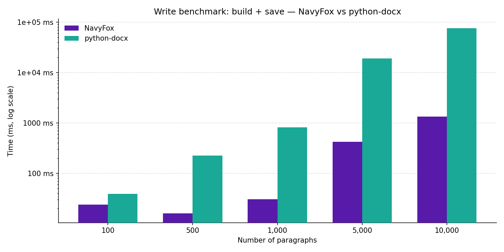
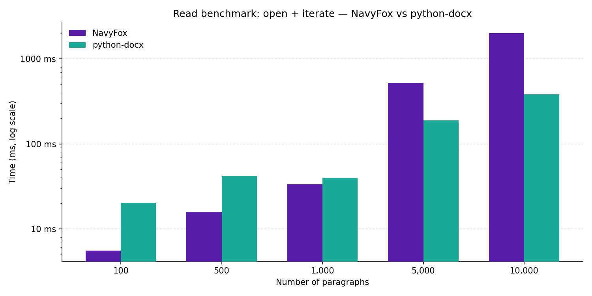
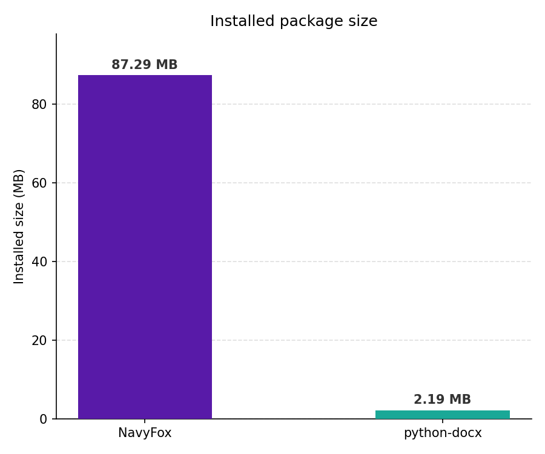

<p align="center">
  
</p>

<h1 align="center">NavyFox</h1>

<p align="center">
  <strong>Python DOCX manipulation backed by a C# Native AOT shared library.</strong><br>
  Clean API. Zero Python dependencies. Microsoft's own OpenXML SDK under the hood.
</p>

<p align="center">
  
  
  
  
</p>

---

## What is NavyFox?

NavyFox is a Python library for creating and editing `.docx` files. Unlike other DOCX libraries that parse and re-emit raw XML in Python, NavyFox delegates all document construction to a **Native AOT-compiled C# binary** built on Microsoft's [DocumentFormat.OpenXml SDK v3.5.1](https://github.com/dotnet/Open-XML-SDK). Python holds lightweight integer handles; all document state lives in C#.

```python
from navyfox import Document

with Document() as doc:
    doc.add_heading("Quarterly Report", level=1)

    p = doc.add_paragraph()
    p.add_run("Revenue grew ").bold = False
    p.add_run("47%").bold = True
    p.add_run(" year-over-year.")

    table = doc.add_table(rows=3, cols=2)
    for (row_i, row_data) in enumerate([
        ["Region", "Revenue"],
        ["North",  "$1.2M"],
        ["South",  "$0.9M"],
    ]):
        for col_i, text in enumerate(row_data):
            table[row_i, col_i].text = text

    doc.save("report.docx")
```

---

## Why NavyFox?

| Concern | python-docx | NavyFox |
|---|---|---|
| Document construction | Pure Python / XML | Native AOT binary |
| OpenXML correctness | Hand-crafted XML | Official Microsoft SDK |
| Python dependencies | 1 (lxml) | **0** |
| Write performance | Baseline | 14–58× faster at scale (see below) |
| Read performance | Baseline | Faster at small docs; FFI cost at large docs |
| Installed size | ~2 MB | ~85 MB (ships runtime) |
| Named paragraph styles | Limited | First-class |
| Horizontal rules | Requires raw lxml XML | `doc.add_horizontal_rule()` |
| Images, hyperlinks, sections | Partial | Full |

### Performance

All document data is assembled in native compiled code — no Python loop overhead building XML trees for large documents.



*__Figure 1 — Write benchmark (build + save, log scale).__
Measures wall-clock time to construct a document with N paragraphs of plain text and an N/10-row × 3-column table, then write it to disk. Each bar is the mean of 2–5 timed runs (fewer repetitions at larger sizes). The Y-axis is log scale. NavyFox is faster at every size because all XML assembly happens inside the native compiled binary — Python only makes one call per element added, with no per-character string concatenation or lxml tree manipulation in the hot path.*



*__Figure 2 — Read benchmark (open + iterate, log scale).__
Measures wall-clock time to open a .docx file and read the `.text` property of every paragraph and every table cell. Both libraries read the same reference files, which are created fresh with python-docx before each run to eliminate any format bias. NavyFox is faster at small document sizes but becomes slower above roughly 1 000 paragraphs. The reason: python-docx parses the entire ZIP archive into an lxml element tree on open, after which `.text` is a free in-memory attribute lookup. NavyFox keeps all state in the native layer, so each `.text` access is an individual ctypes round-trip into C# — fast per call, but the overhead accumulates at scale.*

**Package size trade-off.** The binary ships .NET 9 and the OpenXML SDK statically linked — no separate runtime installation needed. That makes the wheel ~85 MB versus ~2 MB for python-docx; a deliberate trade for zero runtime dependencies.



*__Figure 3 — Installed package size.__
On-disk footprint measured from each library's installed directory. NavyFox is larger because it statically links the .NET 9 runtime and the Microsoft DocumentFormat.OpenXml SDK — there is no separate runtime to install. python-docx's smaller footprint reflects its pure-Python + lxml approach, but lxml itself must be present as a separate dependency.*

> Run `python scripts/benchmark.py && python scripts/generate_charts.py` to reproduce. Error bars (±1 SD) are shown when benchmark data includes standard deviation.

### Horizontal rules

python-docx has no native horizontal rule API. Adding one requires reaching into lxml and writing raw OpenXML:

```python
# python-docx — manual lxml manipulation required
from docx import Document
from docx.oxml import OxmlElement
from docx.oxml.ns import qn

def add_horizontal_rule(doc):
    para = doc.add_paragraph()
    pPr = OxmlElement("w:pPr")
    pBdr = OxmlElement("w:pBdr")
    bottom = OxmlElement("w:bottom")
    bottom.set(qn("w:val"), "single")
    bottom.set(qn("w:sz"), "6")
    bottom.set(qn("w:space"), "1")
    bottom.set(qn("w:color"), "auto")
    pBdr.append(bottom)
    pPr.append(pBdr)
    para._p.insert(0, pPr)
    return para
```

NavyFox exposes it directly:

```python
# NavyFox — first-class API
from navyfox import Document

with Document() as doc:
    doc.add_horizontal_rule()                          # default single line
    doc.add_horizontal_rule(line_style="double")       # double line
    doc.add_horizontal_rule(line_style="dashed", line_width=1.0, line_color="#999999")
    doc.save("output.docx")
```

---

## Installation

```bash
pip install navyfox
```

Pre-compiled wheels ship for:

| Platform | Architecture |
|---|---|
| Linux | x64, arm64 |
| Windows | x64 |
| macOS | arm64 (Apple Silicon) |

> For any other platform you will need to build from source — see [Building from source](#building-from-source).

---

## Feature highlights

- **Paragraphs & runs** — character-level formatting: bold, italic, underline, font, size, colour
- **Named paragraph styles** — define once with inheritance, apply anywhere
- **Tables** — build cell-by-cell or pre-populate from a 2-D list; custom borders and shading
- **Images** — embed from file path, bytes, or URL; control width/height and alt text
- **Hyperlinks** — inline hyperlinks on any run
- **Sections** — page layout, margins, orientation, headers and footers
- **Horizontal rules** — `doc.add_horizontal_rule()`
- **Numbered and bulleted lists** — via `ListFormat`
- **Document metadata** — title, author, subject, keywords
- **Snapshots** — `snapshot(elem)` detaches any proxy from its document for deferred use
- **Open existing documents** — round-trip read + append

---

## Examples

### Mixed-format paragraph

```python
from navyfox import Document

with Document() as doc:
    p = doc.add_paragraph()
    p.add_run("Warning: ").bold = True
    p.add_run("this value is ")
    p.add_run("outside the expected range").italic = True
    p.add_run(".")
    doc.save("output.docx")
```

### Named paragraph styles

```python
from navyfox import Document
from navyfox.units import Color
from navyfox.formats import SpacingFormat

with Document() as doc:
    doc.styles.add(
        "CallOut",
        based_on="Normal",
        bold=True,
        font_size=11,
        color=Color.from_hex("1F497D"),
        alignment="center",
        spacing=SpacingFormat(before=120, after=120),
    )

    doc.add_paragraph("Key insight here", style="CallOut")
    doc.add_paragraph("Another key insight", style="CallOut")
    doc.save("output.docx")
```

### Tables

```python
from navyfox import Document

with Document() as doc:
    # Build cell-by-cell using [row, col] indexing
    t = doc.add_table(rows=3, cols=3)
    for col, heading in enumerate(["Name", "Role", "Team"]):
        t[0, col].text = heading
    t[1, 0].text = "Alice"; t[1, 1].text = "Engineer"; t[1, 2].text = "Platform"
    t[2, 0].text = "Bob";   t[2, 1].text = "Designer"; t[2, 2].text = "Product"

    doc.save("output.docx")
```

### Images

```python
from navyfox import Document
from navyfox.units import Inches

with Document() as doc:
    doc.add_heading("Findings", level=1)
    doc.add_image("chart.png", width=Inches(5), alt_text="Q1 chart")
    doc.save("output.docx")
```

### Hyperlinks

```python
from navyfox import Document

with Document() as doc:
    p = doc.add_paragraph()
    p.add_run("Visit ")
    p.add_hyperlink("navyfox docs", url="https://example.com/docs")
    p.add_run(" for the full reference.")
    doc.save("output.docx")
```

### Open an existing document and append

```python
from navyfox import Document

with Document.open("existing.docx") as doc:
    doc.add_heading("Appendix", level=1)
    doc.add_paragraph().add_run("Added programmatically.").italic = True
    doc.save("updated.docx")
```

### Snapshot — use a proxy after the document closes

```python
from navyfox import Document, snapshot

with Document.open("report.docx") as doc:
    snap = snapshot(doc.paragraphs[0])  # copy before close

# doc is closed here — snap is still valid
print(snap.text)
```

### Document metadata

```python
from navyfox import Document

with Document() as doc:
    doc.title   = "Q1 Report"
    doc.author  = "Finance Team"
    doc.subject = "Revenue summary"
    doc.save("report.docx")
```

---

## Construction syntax

Every element type in NavyFox has two modes:

- **Construction state** — created without a document; all data is stored in Python. Use this to build up elements before appending them, or to pass elements between documents.
- **Live proxy** — returned after an element is appended to a document; every property access crosses the FFI boundary into C#.

The `add_*` helpers (e.g. `doc.add_paragraph()`) are shorthand that create a construction object and append it in one call, returning the live proxy.

### Two ways to build the same paragraph

```python
from navyfox import Document, Paragraph, Run

with Document() as doc:
    # — Shorthand (most common) —
    p = doc.add_paragraph()
    p.add_run("Normal, ").bold = False
    p.add_run("bold, ").bold = True
    p.add_run("italic.").italic = True

    # — Construction-then-append —
    para = Paragraph(style="Normal")
    para.runs.append(Run("Normal, "))
    para.runs.append(Run("bold, ", bold=True))
    para.runs.append(Run("italic.", italic=True))
    doc.paragraphs.append(para)   # becomes live on append

    doc.save("output.docx")
```

### Constructing elements with keyword arguments

`Paragraph`, `Run`, and `HorizontalRule` all accept their properties directly in `__init__`:

```python
from navyfox import Paragraph, Run, HorizontalRule

# Paragraph with style and spacing
para = Paragraph(
    "Key takeaway",
    style="Heading2",
    alignment="center",
    space_before=6.0,   # points
    space_after=6.0,
)

# Run with character formatting
run = Run(
    "Important",
    bold=True,
    italic=True,
    font_name="Arial",
    font_size=14,
    color="#CC0000",
)

# Horizontal rule with a custom style
rule = HorizontalRule(line_style="double", line_width=1.5, line_color="#333333")
```

### Fluent chaining

All setters on `Run` and `Paragraph` return `self`, so you can chain calls:

```python
from navyfox import Document

with Document() as doc:
    # Run method chaining
    run = doc.add_paragraph().add_run("Important")
    run.set_bold().set_italic().set_color("#CC0000").set_font("Arial", 14)

    # Paragraph.format() batches multiple properties in one FFI call
    p = doc.add_paragraph("Note")
    p.format(alignment="center", space_before=6.0, space_after=6.0)

    # Run.format() does the same for character formatting
    r = doc.add_paragraph().add_run("Warning")
    r.format(bold=True, color="#FF0000", font_size=12)

    doc.save("output.docx")
```

### Batch append

`doc.paragraphs.extend()` or `+=` appends multiple elements in one pass:

```python
from navyfox import Document, Paragraph, Run

items = ["First point", "Second point", "Third point"]

with Document() as doc:
    doc.paragraphs.extend(
        Paragraph(text, list_style="bullet") for text in items
    )
    doc.save("output.docx")
```

### Lists

```python
from navyfox import Document

with Document() as doc:
    doc.add_bullet("Unordered item")
    doc.add_bullet("Nested item", level=1)
    doc.add_numbered("First step")
    doc.add_numbered("Second step")
    doc.save("output.docx")
```

### In-place editing with `Document.edit()`

`Document.edit()` is like `Document.open()` but automatically saves back to the source path when the context manager exits:

```python
from navyfox import Document

with Document.edit("existing.docx") as doc:
    doc.paragraphs[0].text = "Updated heading"
    doc.add_paragraph("New paragraph appended.")
# saved automatically — no explicit doc.save() needed
```

---

## API reference

### `Document`

| Member | Description |
|---|---|
| `Document()` / `Document.open(path)` | Create a new document or open an existing one for reading. |
| `Document.edit(path)` | Open for in-place editing; auto-saves on context-manager exit. |
| `doc.add_paragraph(text="", style="Normal")` | Append a paragraph; returns `Paragraph`. |
| `doc.add_heading(text, level=1)` | Append a heading (levels 1–9); returns `Paragraph`. |
| `doc.add_table(rows, cols, style="TableGrid")` | Append a table; returns `Table`. |
| `doc.add_bullet(text="", level=0)` | Append a bulleted list item; returns `Paragraph`. |
| `doc.add_numbered(text="", level=0)` | Append a numbered list item; returns `Paragraph`. |
| `doc.add_image(src, *, width=0.0, height=0.0, alt_text="")` | Embed an image; returns `Image`. |
| `doc.add_horizontal_rule(*, line_style, line_width, line_color)` | Append a horizontal rule; returns `HorizontalRule`. |
| `doc.paragraphs` | Filtered `DocumentView[Paragraph]`. |
| `doc.tables` | Filtered `DocumentView[Table]`. |
| `doc.sections` | Filtered `DocumentView[Section]`. |
| `doc.styles` | `StyleCollection` — define and look up named styles. |
| `doc.margins` | Get/set page margins across all sections (shorthand for `PageMargins`). |
| `doc.title`, `doc.author`, `doc.subject` | Document core properties. |
| `doc.save(path)` | Write the document to *path*. |
| `doc.close()` | Free the native handle explicitly. |

### `Paragraph`

```python
p = doc.add_paragraph(style="Normal")
run = p.add_run("Hello ")
run.bold = True
p.add_run("world")

p.text   # full concatenated text of all runs
p.runs   # list[Run]
p.style  # style name
p.alignment          # "left" | "center" | "right" | "justify"
p.spacing            # SpacingFormat
p.indent             # IndentFormat
```

### `Run`

```python
run = p.add_run("Hello")

run.bold        = True           # True / False
run.italic      = True
run.underline   = True           # True or "single"/"double"/"dotted"/"dashed"/"wave"
run.strikethrough = True
run.all_caps    = True           # mutually exclusive with small_caps
run.superscript = True           # mutually exclusive with subscript
run.color       = "#FF0000"      # hex string or Color instance
run.highlight   = "yellow"
run.font_name   = "Arial"
run.font_size   = 12             # points
run.language    = "en-US"

# Fluent setters — each returns self
run.set_bold().set_italic().set_color("#CC0000").set_font("Arial", 14)

# Batch update in one FFI call
run.format(bold=True, italic=True, font_size=14, color="#CC0000")
```

### `Table` / `Row` / `Cell`

```python
table[row, col]               # Cell — zero-indexed
table[row, col].text = "v"
table[row, col].paragraphs    # list[Paragraph]
table.rows                    # list[Row]
table.rows[0].cells           # list[Cell]
```

### `Section`

```python
section = doc.sections[0]
section.page_width   = Inches(8.5)
section.page_height  = Inches(11)
section.margins      = PageMargins(top=Inches(1), bottom=Inches(1),
                                   left=Inches(1.25), right=Inches(1.25))
section.orientation  = "landscape"
```

### Unit types

```python
from navyfox.units import Inches, Centimeters, Millimeters, Points, Twips, Color

Inches(1.0)          # 914400 EMUs
Centimeters(2.54)    # same
Points(72)           # same
Color.from_hex("FF0000")
Color.from_rgb(255, 0, 0)
```

### Enums

```python
from navyfox.enums import Alignment, HeadingLevel, ColorName

Alignment.LEFT | Alignment.CENTER | Alignment.RIGHT | Alignment.JUSTIFY
HeadingLevel.H1               # use with add_heading(level=HeadingLevel.H1)
ColorName.RED.color           # Color instance
```

---

## Architecture

```
┌─────────────────────────────────────────────────────┐
│  Python (navyfox)                                   │
│                                                     │
│  Document  Paragraph  Run  Table  Image  Section    │
│     │          │       │     │      │       │       │
│     └──────────┴───────┴─────┴──────┴───────┘       │
│                        │                            │
│              ctypes FFI boundary                    │
└────────────────────────┼────────────────────────────┘
                         │
┌────────────────────────▼────────────────────────────┐
│  NavyFox.Native  (C# Native AOT, no .NET runtime)   │
│                                                     │
│  NativeExports.cs  [UnmanagedCallersOnly] entry pts │
│  DocumentBuilder   OpenXML logic per feature area   │
│  Marshalling/      FFI-boundary struct layouts      │
└─────────────────────────────────────────────────────┘
                         │
┌────────────────────────▼────────────────────────────┐
│  DocumentFormat.OpenXml SDK v3.5.1  (Microsoft)     │
└─────────────────────────────────────────────────────┘
```

Python objects are **proxy handles** — lightweight `int` wrappers. Every property access crosses the FFI boundary into native code. `snapshot(elem)` detaches an element from its handle so it survives after the document is closed or can be re-attached to a different document.

---

## Building from source

### Prerequisites

- .NET 9 SDK
- Python ≥ 3.12
- `clang` (Linux only — required by Native AOT)

### Build the native library

```bash
# Replace linux-x64 with your target RID (linux-arm64, win-x64, osx-arm64)
dotnet publish native/NavyFox.Native \
  -r linux-x64 -c Release \
  -p:PublishAot=true -p:NativeLib=Shared \
  -o navyfox/_libs/linux-x64/
```

### Install the Python package

```bash
pip install -e ".[dev]"
```

### Run the tests

```bash
# Python unit tests — no native binary required
pytest tests/unit/

# Python integration tests — requires native binary
pytest tests/integration/

# C# unit tests
dotnet test tests/native/NavyFox.Native.Tests/
```

---

## Project layout

```
navyfox/                      Python package
  _native/
    loader.py                  Platform-aware lazy binary loader
    bindings.py                ctypes declarations
  _libs/                       Pre-compiled native binaries
    linux-x64/
    linux-arm64/
    win-x64/
    osx-arm64/
native/NavyFox.Native/         C# Native AOT shared library
  NativeExports.cs             [UnmanagedCallersOnly] entry points
  DocumentBuilder.cs           Core OpenXML document logic
  DocumentBuilder.*.cs         Feature-area partials (tables, images, …)
  Marshalling/
    StructLayouts.cs           FFI-boundary struct definitions
tests/
  unit/                        Python unit tests (mocked native layer)
  integration/                 Round-trip tests (require native binary)
  native/                      C# xUnit tests
scripts/
  check_struct_layouts.py      CI struct annotation guard
  benchmark.py                 Performance benchmark
  generate_charts.py           Render benchmark result charts
.github/workflows/
  build-native.yml             Matrix AOT publish
  ci.yml                       Lint / type-check / test
  release.yml                  Wheel build and PyPI publish
```

---

## License

[MIT](LICENSE)
