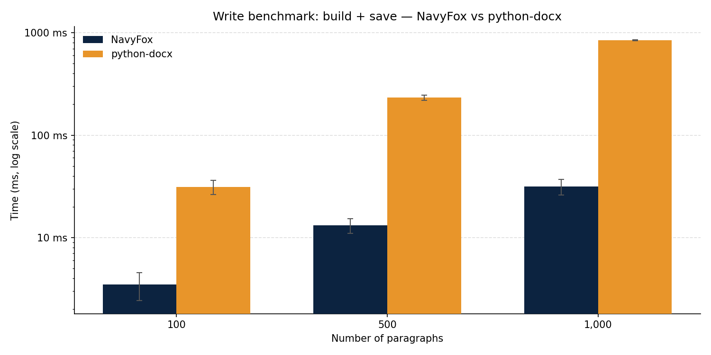
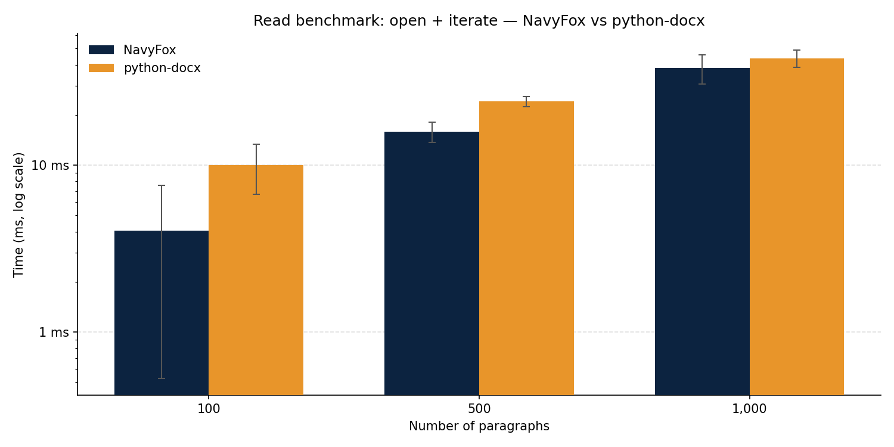
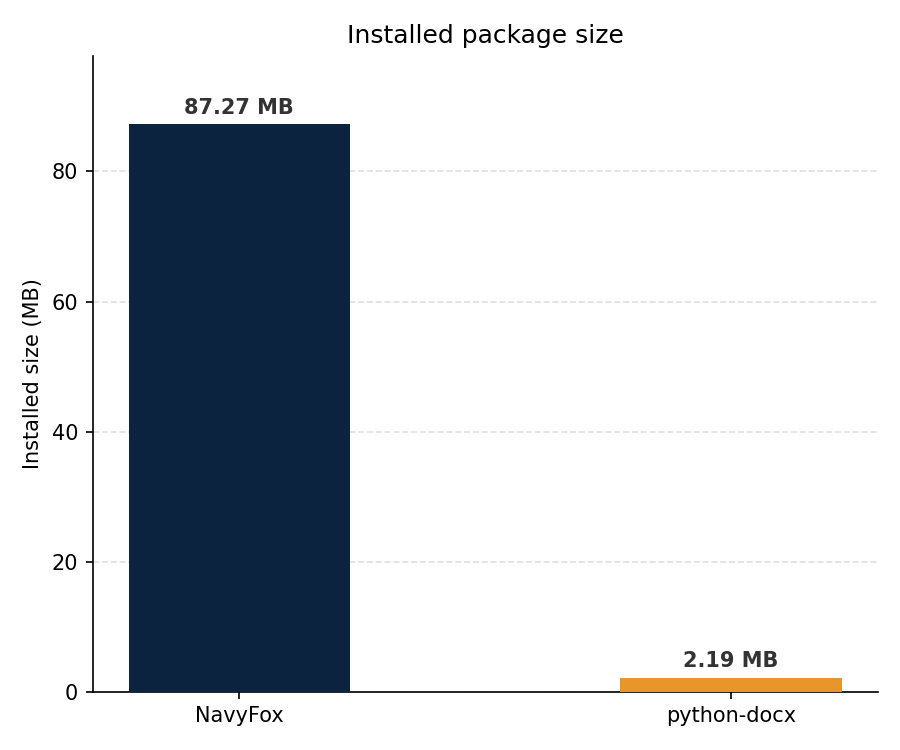

<p align="center">
  
</p>

<h1 align="center">NavyFox</h1>

<p align="center">
  <strong>Python DOCX manipulation backed by a C# Native AOT shared library.</strong><br>
  Clean API. Zero Python dependencies. Microsoft's own OpenXML SDK under the hood.
</p>

<p align="center">
  
  
  
  
</p>

---

## What is NavyFox?

NavyFox is a Python library for creating and editing `.docx` files. Unlike other DOCX libraries that parse and re-emit raw XML in Python, NavyFox delegates all document construction to a **Native AOT-compiled C# binary** built on Microsoft's [DocumentFormat.OpenXml SDK v3.5.1](https://github.com/dotnet/Open-XML-SDK). Python holds lightweight integer handles; all document state lives in C#.

Elements are constructed as plain Python objects — with text and formatting set upfront — then appended to the document in one step:

```python
from navyfox import Document, Paragraph, Run, Table

with Document() as doc:
    doc.append(Paragraph("Quarterly Report", style="Heading1"))

    doc.append(Paragraph(
        Run("Revenue grew "),
        Run("47%", bold=True),
        " year-over-year.",
    ))

    table = doc.append(Table(rows=3, cols=2))
    for row_i, row_data in enumerate([
        ["Region", "Revenue"],
        ["North",  "$1.2M"],
        ["South",  "$0.9M"],
    ]):
        for col_i, text in enumerate(row_data):
            table[row_i, col_i].text = text

    doc.save("report.docx")
```

---

## Why NavyFox?

| Concern | python-docx | NavyFox |
|---|---|---|
| Document construction | Pure Python / XML | Native AOT binary |
| OpenXML correctness | Hand-crafted XML | Official Microsoft SDK |
| Python dependencies | 1 (lxml) | **0** |
| Write performance | Baseline | 14–58× faster at scale (see below) |
| Read performance | Baseline | Faster at small docs; FFI cost at large docs |
| Installed size | ~2 MB | ~85 MB (ships runtime) |
| Named paragraph styles | Limited | First-class |
| Horizontal rules | Requires raw lxml XML | `doc.append(HorizontalRule())` |
| Images, hyperlinks, sections | Partial | Full |

### Performance

All document data is assembled in native compiled code — no Python loop overhead building XML trees for large documents.



*__Figure 1 — Write benchmark (build + save, log scale).__
Measures wall-clock time to construct a document with N paragraphs of plain text and an N/10-row × 3-column table, then write it to disk. Each bar is the mean of 2–5 timed runs (fewer repetitions at larger sizes). The Y-axis is log scale. NavyFox is faster at every size because all XML assembly happens inside the native compiled binary — Python only makes one call per element added, with no per-character string concatenation or lxml tree manipulation in the hot path.*



*__Figure 2 — Read benchmark (open + iterate, log scale).__
Measures wall-clock time to open a .docx file and read the `.text` property of every paragraph and every table cell. Both libraries read the same reference files, which are created fresh with python-docx before each run to eliminate any format bias. NavyFox is faster at small document sizes but becomes slower above roughly 1 000 paragraphs. The reason: python-docx parses the entire ZIP archive into an lxml element tree on open, after which `.text` is a free in-memory attribute lookup. NavyFox keeps all state in the native layer, so each `.text` access is an individual ctypes round-trip into C# — fast per call, but the overhead accumulates at scale.*

**Package size trade-off.** The binary ships .NET 9 and the OpenXML SDK statically linked — no separate runtime installation needed. That makes the wheel ~85 MB versus ~2 MB for python-docx; a deliberate trade for zero runtime dependencies.



*__Figure 3 — Installed package size.__
On-disk footprint measured from each library's installed directory. NavyFox is larger because it statically links the .NET 9 runtime and the Microsoft DocumentFormat.OpenXml SDK — there is no separate runtime to install. python-docx's smaller footprint reflects its pure-Python + lxml approach, but lxml itself must be present as a separate dependency.*

> Run `python scripts/benchmark.py && python scripts/generate_charts.py` to reproduce.

### Horizontal rules

python-docx has no native horizontal rule API. Adding one requires reaching into lxml and writing raw OpenXML:

```python
# python-docx — manual lxml manipulation required
from docx import Document
from docx.oxml import OxmlElement
from docx.oxml.ns import qn

def add_horizontal_rule(doc):
    para = doc.add_paragraph()
    pPr = OxmlElement("w:pPr")
    pBdr = OxmlElement("w:pBdr")
    bottom = OxmlElement("w:bottom")
    bottom.set(qn("w:val"), "single")
    bottom.set(qn("w:sz"), "6")
    bottom.set(qn("w:space"), "1")
    bottom.set(qn("w:color"), "auto")
    pBdr.append(bottom)
    pPr.append(pBdr)
    para._p.insert(0, pPr)
    return para
```

NavyFox exposes it directly:

```python
from navyfox import Document, HorizontalRule

with Document() as doc:
    doc.append(HorizontalRule())
    doc.append(HorizontalRule(line_style="double"))
    doc.append(HorizontalRule(line_style="dashed", line_width=1.0, line_color="#999999"))
    doc.save("output.docx")
```

---

## Installation

```bash
pip install navyfox
```

Pre-compiled wheels ship for:

| Platform | Architecture |
|---|---|
| Linux | x64, arm64 |
| Windows | x64 |
| macOS | arm64 (Apple Silicon) |

> For any other platform you will need to build from source — see [Building from source](#building-from-source).

---

## Feature highlights

- **Paragraphs & runs** — character-level formatting: bold, italic, underline, font, size, colour
- **Named paragraph styles** — define once with inheritance, apply anywhere
- **Tables** — build cell-by-cell or pre-populate from a 2-D list; custom borders and shading
- **Images** — embed from file path, bytes, or URL; control width/height and alt text
- **Hyperlinks** — inline hyperlinks on any run
- **Sections** — page layout, margins, orientation, headers and footers
- **Horizontal rules** — first-class, no raw XML required
- **Numbered and bulleted lists** — via `list_style` on `Paragraph`
- **Document metadata** — title, author, subject, keywords
- **Snapshots** — `snapshot(elem)` detaches any proxy from its document for deferred use
- **Open existing documents** — round-trip read + append

---

## Builder syntax

Every element in NavyFox is a plain Python object. Construct it with all its content and properties set upfront, then pass it to `doc.append()`. The element becomes a live proxy — backed by the native layer — at the moment of append.

### `Paragraph` constructor

The first argument is the content: a plain string, a single `Run`, or a list mixing strings and `Run` objects. All formatting properties are keyword arguments:

```python
from navyfox import Paragraph, Run

# Plain text
Paragraph("Simple body text")

# Mixed runs — strings are promoted to plain Run objects automatically
Paragraph(
    Run("Revenue grew "),
    Run("47%", bold=True),
    " year-over-year.",        # plain string → Run("year-over-year.")
)

# With paragraph-level formatting
Paragraph(
    Run("Key takeaway", bold=True),
    style="Heading2",
    alignment="center",
    space_before=12.0,         # points
    space_after=6.0,
)
```

### `Run` constructor

```python
from navyfox import Run
from navyfox.units import Color

Run(
    "Important",
    bold=True,
    italic=True,
    underline=True,            # True or "single"/"double"/"dotted"/"dashed"/"wave"
    color="#CC0000",           # hex string or Color instance
    font_name="Arial",
    font_size=14.0,            # points
    all_caps=False,
    highlight="yellow",
)
```

### `doc.append()` and `doc.extend()`

`doc.append()` accepts any body element and returns the live proxy:

```python
with Document() as doc:
    doc.append(Paragraph("Intro", style="Heading1"))

    table = doc.append(Table(rows=4, cols=3))   # returns live Table
    table[0, 0].text = "Header"

    doc.append(HorizontalRule())

    doc.save("output.docx")
```

`doc.extend()` appends multiple elements in one pass — useful with list literals or generators:

```python
items = ["First point", "Second point", "Third point"]

doc.extend([
    Paragraph("Summary", style="Heading1"),
    Paragraph(items[0], list_style="bullet"),
    Paragraph(items[1], list_style="bullet"),
    Paragraph(items[2], list_style="bullet"),
])

# or with a generator
doc.extend(Paragraph(t, list_style="bullet") for t in items)
```

### Batch property updates with `format()`

After an element is live, `format()` batches multiple property changes into a single FFI call and returns `self`:

```python
with Document() as doc:
    para = doc.append(Paragraph("Draft", style="Normal"))
    para.format(alignment="center", space_before=12.0, space_after=12.0)
    para.runs[0].format(bold=True, color="#CC0000", font_size=11.0)
    doc.save("output.docx")
```

> **Tip:** When building a new document, prefer setting everything in the constructor. `format()` is most useful when modifying elements read back from an existing file.

---

## Examples

### Mixed-format paragraph

```python
from navyfox import Document, Paragraph, Run

with Document() as doc:
    doc.append(Paragraph(
        Run("Warning: ", bold=True),
        "this value is ",
        Run("outside the expected range", italic=True),
        ".",
    ]))
    doc.save("output.docx")
```

### Named paragraph styles

```python
from navyfox import Document, Paragraph
from navyfox.units import Color
from navyfox.formats import SpacingFormat

with Document() as doc:
    doc.styles.add(
        "CallOut",
        based_on="Normal",
        bold=True,
        font_size=11,
        color=Color.from_hex("1F497D"),
        alignment="center",
        spacing=SpacingFormat(before=120, after=120),
    )

    doc.extend([
        Paragraph("Key insight here",    style="CallOut"),
        Paragraph("Another key insight", style="CallOut"),
    ])
    doc.save("output.docx")
```

### Tables

```python
from navyfox import Document, Table

with Document() as doc:
    table = doc.append(Table(rows=3, cols=3))
    for col, heading in enumerate(["Name", "Role", "Team"]):
        table[0, col].text = heading
    table[1, 0].text = "Alice"; table[1, 1].text = "Engineer"; table[1, 2].text = "Platform"
    table[2, 0].text = "Bob";   table[2, 1].text = "Designer"; table[2, 2].text = "Product"
    doc.save("output.docx")
```

### Images

```python
from navyfox import Document, Paragraph
from navyfox.units import Inches

with Document() as doc:
    doc.append(Paragraph("Findings", style="Heading1"))
    doc.add_image("chart.png", width=Inches(5), alt_text="Q1 chart")
    doc.save("output.docx")
```

### Hyperlinks

```python
from navyfox import Document, Paragraph, Run

with Document() as doc:
    para = doc.append(Paragraph(style="Normal"))
    para.runs.append(Run("Visit "))
    para.add_hyperlink("navyfox docs", url="https://example.com/docs")
    para.runs.append(Run(" for the full reference."))
    doc.save("output.docx")
```

### Lists

```python
from navyfox import Document, Paragraph

with Document() as doc:
    doc.extend([
        Paragraph("Unordered item",  list_style="bullet"),
        Paragraph("Nested item",     list_style="bullet", list_level=1),
        Paragraph("First step",      list_style="number"),
        Paragraph("Second step",     list_style="number"),
    ])
    doc.save("output.docx")
```

### Open an existing document and append

```python
from navyfox import Document, Paragraph, Run

with Document.open("existing.docx") as doc:
    doc.append(Paragraph("Appendix", style="Heading1"))
    doc.append(Paragraph(Run("Added programmatically.", italic=True)))
    doc.save("updated.docx")
```

### In-place editing with `Document.edit()`

`Document.edit()` is like `Document.open()` but saves back to the source path automatically when the context manager exits:

```python
from navyfox import Document

with Document.edit("existing.docx") as doc:
    doc.paragraphs[0].text = "Updated heading"
    doc.paragraphs[0].format(alignment="center")
# saved automatically — no explicit doc.save() needed
```

### Snapshot — use a proxy after the document closes

```python
from navyfox import Document, snapshot

with Document.open("report.docx") as doc:
    snap = snapshot(doc.paragraphs[0])  # copy before close

# doc is closed here — snap is still valid
print(snap.text)
```

### Document metadata

```python
from navyfox import Document

with Document() as doc:
    doc.title   = "Q1 Report"
    doc.author  = "Finance Team"
    doc.subject = "Revenue summary"
    doc.save("report.docx")
```

---

## API reference

### `Document`

| Member | Description |
|---|---|
| `Document()` | Create a new empty document. |
| `Document.open(path)` | Open an existing `.docx` for reading or writing. |
| `Document.edit(path)` | Open for in-place editing; auto-saves on context-manager exit. |
| `doc.append(elem)` | Append a `Paragraph`, `Table`, or `HorizontalRule`; returns the live proxy. |
| `doc.extend(elems)` | Append multiple elements. |
| `doc.paragraphs` | `DocumentView[Paragraph]` — iterate, index, slice, pop. |
| `doc.tables` | `DocumentView[Table]`. |
| `doc.sections` | `DocumentView[Section]`. |
| `doc.styles` | `StyleCollection` — define and look up named styles. |
| `doc.margins` | Get/set page margins across all sections. |
| `doc.title`, `doc.author`, `doc.subject` | Document core properties. |
| `doc.save(path)` | Write the document to *path*. |
| `doc.close()` | Free the native handle explicitly. |

### `Paragraph`

```python
Paragraph(
    text_or_runs,              # str | Run | list[str | Run] | None
    *,
    style="Normal",
    alignment=None,            # "left" | "right" | "center" | "justify"
    space_before=0.0,          # points
    space_after=0.0,
    line_spacing=1.0,          # multiplier
    indent_left=0.0,           # inches
    indent_right=0.0,
    indent_hanging=0.0,
    keep_together=False,
    keep_with_next=False,
    page_break_before=False,
    list_style=None,           # "bullet" | "number"
    list_level=0,
)

# Live proxy — read back after append
para.text        # full concatenated text
para.runs        # DocumentView[Run]
para.style       # style name string
para.alignment   # "left" | "center" | "right" | "justify"

# Batch-update after append (single FFI call, returns self)
para.format(alignment="center", space_before=12.0)
```

### `Run`

```python
Run(
    text,                      # str
    *,
    bold=False,
    italic=False,
    underline=False,           # bool or "single"/"double"/"dotted"/"dashed"/"wave"
    strikethrough=False,
    all_caps=False,            # mutually exclusive with small_caps
    small_caps=False,
    superscript=False,         # mutually exclusive with subscript
    subscript=False,
    color=None,                # "#RRGGBB" hex string or Color instance
    highlight=None,            # color name string
    font_name=None,
    font_size=None,            # points
    language=None,             # e.g. "en-US"
)

# Assign properties on a live proxy
run.bold      = True
run.color     = "#CC0000"

# Batch-update (single FFI call, returns self)
run.format(bold=True, italic=True, font_size=14.0, color="#CC0000")
```

### `Table`

```python
table = doc.append(Table(rows=4, cols=3, style="TableGrid"))

table[row, col]              # Cell — zero-indexed
table[row, col].text = "v"  # set cell plain text
table[row, col].paragraphs  # DocumentView[Paragraph] for richer content
table.rows                   # DocumentView[Row]
table.rows[0].cells          # DocumentView[Cell]
table.rows[0].is_header = True
```

### `DocumentView` — the collection interface

`doc.paragraphs`, `doc.tables`, and similar properties return a `DocumentView` with the full sequence protocol:

```python
view[0]                      # index
view[-1]                     # negative index
view[1:3]                    # slice (read-only view)
len(view)                    # count
for elem in view: ...        # iterate
view.pop(0)                  # remove and return as snapshot
view.remove(elem)            # remove by identity
view.clear()                 # remove all
```

### `Section`

```python
from navyfox.formats import PageMargins
from navyfox.units import Inches

section = doc.sections[0]
section.page_width   = Inches(8.5)
section.page_height  = Inches(11)
section.margins      = PageMargins(top=1.0, bottom=1.0, left=1.25, right=1.25)
section.orientation  = "landscape"
```

### Unit types

```python
from navyfox.units import Inches, Centimeters, Millimeters, Points, Twips, Color

Inches(1.0)           # 914400 EMUs
Centimeters(2.54)     # same
Points(72)            # same
Color.from_hex("FF0000")
Color.from_rgb(255, 0, 0)
```

---

## Architecture

```
┌─────────────────────────────────────────────────────┐
│  Python (navyfox)                                   │
│                                                     │
│  Document  Paragraph  Run  Table  Image  Section    │
│     │          │       │     │      │       │       │
│     └──────────┴───────┴─────┴──────┴───────┘       │
│                        │                            │
│              ctypes FFI boundary                    │
└────────────────────────┼────────────────────────────┘
                         │
┌────────────────────────▼────────────────────────────┐
│  NavyFox.Native  (C# Native AOT, no .NET runtime)   │
│                                                     │
│  NativeExports.cs  [UnmanagedCallersOnly] entry pts │
│  DocumentBuilder   OpenXML logic per feature area   │
│  Marshalling/      FFI-boundary struct layouts      │
└─────────────────────────────────────────────────────┘
                         │
┌────────────────────────▼────────────────────────────┐
│  DocumentFormat.OpenXml SDK v3.5.1  (Microsoft)     │
└─────────────────────────────────────────────────────┘
```

Python objects are **proxy handles** — lightweight `int` wrappers. Every property access crosses the FFI boundary into native code. Elements exist in two states:

- **Construction state** — a plain Python object before `doc.append()`. Properties are stored in a Python dict; no native handle exists yet. The object can be passed freely between functions and modules.
- **Live proxy** — after `doc.append(elem)`. The element's data is flushed to the native layer; subsequent property reads and writes cross the FFI boundary.

`snapshot(elem)` copies a live proxy back into construction state so it can survive after the document closes or be appended to a different document.

---

## Building from source

### Prerequisites

- .NET 9 SDK
- Python ≥ 3.12
- `clang` (Linux only — required by Native AOT)

### Build the native library

```bash
# Replace linux-x64 with your target RID (linux-arm64, win-x64, osx-arm64)
dotnet publish native/NavyFox.Native \
  -r linux-x64 -c Release \
  -p:PublishAot=true -p:NativeLib=Shared \
  -o navyfox/_libs/linux-x64/
```

### Install the Python package

```bash
pip install -e ".[dev]"
```

### Run the tests

```bash
# Python unit tests — no native binary required
pytest tests/unit/

# Python integration tests — requires native binary
pytest tests/integration/

# C# unit tests
dotnet test tests/native/NavyFox.Native.Tests/
```

---

## Project layout

```
navyfox/                      Python package
  _native/
    loader.py                  Platform-aware lazy binary loader
    bindings.py                ctypes declarations
  _libs/                       Pre-compiled native binaries
    linux-x64/
    linux-arm64/
    win-x64/
    osx-arm64/
native/NavyFox.Native/         C# Native AOT shared library
  NativeExports.cs             [UnmanagedCallersOnly] entry points
  DocumentBuilder.cs           Core OpenXML document logic
  DocumentBuilder.*.cs         Feature-area partials (tables, images, …)
  Marshalling/
    StructLayouts.cs           FFI-boundary struct definitions
tests/
  unit/                        Python unit tests (mocked native layer)
  integration/                 Round-trip tests (require native binary)
  native/                      C# xUnit tests
scripts/
  check_struct_layouts.py      CI struct annotation guard
  benchmark.py                 Performance benchmark
  generate_charts.py           Render benchmark result charts
.github/workflows/
  build-native.yml             Matrix AOT publish
  ci.yml                       Lint / type-check / test
  release.yml                  Wheel build and PyPI publish
```

---

## License

[MIT](LICENSE)
